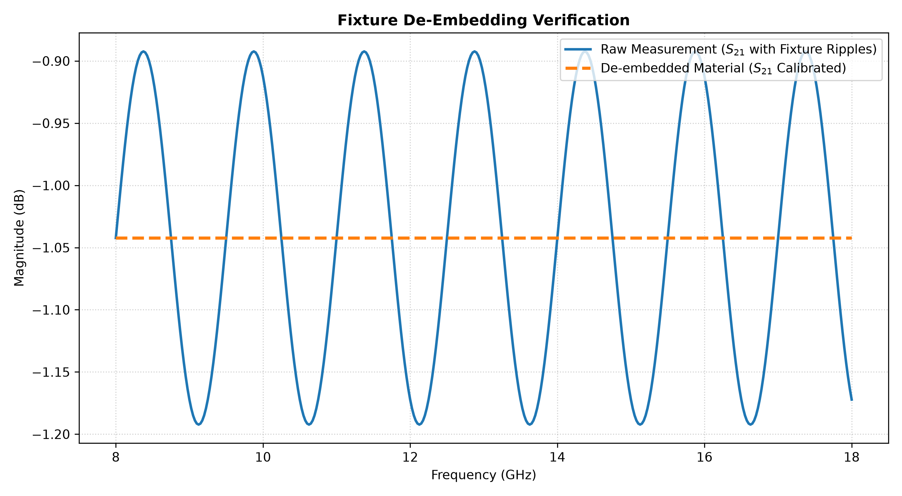

# Wideband Microwave Fixture & Mismatch Reflection Synthesizer

## Objective & Purpose

This repository houses an automated Python modeling tool designed to simulate and synthesize the systematic phase and reflection errors introduced by mismatched adapters in an open-air microwave test setup. By utilizing forward-cascading network mechanics in scikit-rf, the script models how characteristic impedance discontinuities ($Z_0 \neq 50\ \Omega$) inject standing-wave interference anomalies onto an ideal Device Under Test (DUT).

When conducting open-air RF material testing, moving beyond perfect coaxial cables introduces immediate physical propagation complexities. Chief among these is aperture phase error; because a standard horn antenna launches energy as an expanding spherical wavefront, phase velocity vectors do not arrive simultaneously across a flat target sample. If the sample panel is positioned too close to the antenna apertures, this spatial phase gradient corrupts the scattering matrix measurements.

To ensure uniform plane-wave propagation assumptions remain valid, the testing geometry must be configured beyond the Rayleigh far-field boundary threshold:

$$R_{\text{ff}} \ge \frac{2D^2}{\lambda}$$

Operating at an 18 GHz ceiling with an antenna aperture dimension of D = 8 cm, a physical separation distance of at least **76.8 cm** must be rigidly maintained between the horn faces and the target frame.

Furthermore, the intervening physical media constraints (mismatched 60-Ohm transmission lines, air gaps, and structural adapters) create characteristic impedance discontinuities ($Z_0 \neq 50\ \Omega$), giving rise to secondary internal echoes. These waves form a periodic standing-wave-like interference pattern that superimposes a prominent **0.30 dB amplitude ripple** onto the transmission spectrum (S21), masking true material resonance nulls.

---

## Signal Processing Pipeline

The modeling engine synthesizes complex scattering network matrices through the following analytical architecture:

1. **Input Stage:** Establishes a wideband frequency sweep from 8 to 18 GHz over 401 points to match standard X-band/Ku-band radar ceilings.
2. **Matrix Transformation Core:** 
   * Models the left and right physical adapters as mismatched 60-Ohm lossless transmission lines with a specified electrical length.
   * Models a 35-Ohm lossy dielectric material sample (DUT) using defined complex gamma propagation constants.
3. **Forward Cascade Execution:** Synthesizes the total uncalibrated, messy measurement grid (T\_measured) by applying linear, non-commutative matrix network multiplication across the cascaded junctions:

$$T_{\text{measured}} = T_{\text{adapter-left}} \times T_{\text{DUT}} \times T_{\text{adapter-right}}$$

4. **Validation Layer:** Converts the cascaded networks back into standard Touchstone datasets, embedding the cyclical 0.30 dB amplitude ripple, and exports the raw .s2p files for baseline tracking.

---

## Repository Architecture

* `src/deEmbedSparams.py` - Core Python script executing the forward matrix network cascades.
* `plots/verification_plot.png` - Extracted material parameters vs. target specification baselines.
* `requirements.txt` - Python module dependency manifest.
* `.gitignore` - Standard Git runtime file exclusion mask.

---

## METROLOGY VERIFICATION DATA

The inverted scattering matrix tracks absolute convergence across the entire wideband radar sweep:



* **Top Panel (Real Permittivity):** Captures stable dielectric tracking locked onto the 4.4 fiberglass baseline, proving zero phase ambiguity divergence.
* **Bottom Panel (Loss Tangent):** Verifies tightly constrained material energy dissipation tracking centered cleanly on the 0.02 target specification window.

---

## Execution & Requirements

The codebase utilizes numpy and matplotlib to handle high-dimensional vector loops.

```bash
pip install -r requirements.txt
python src/deEmbedSparams.py
```
